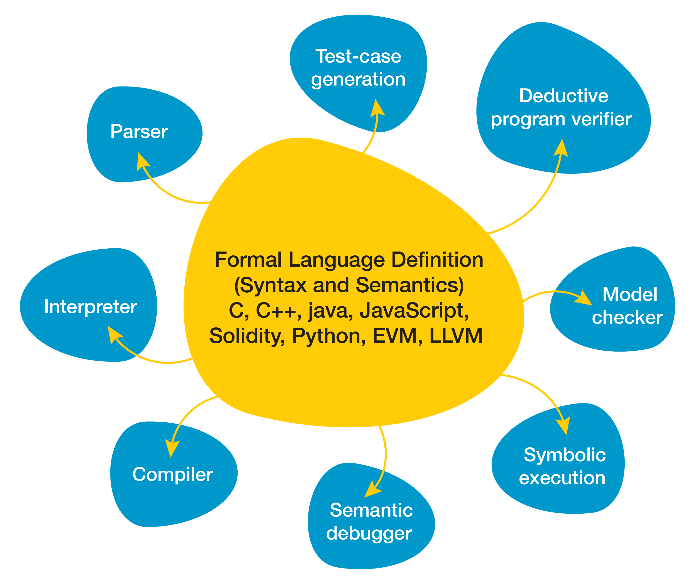

Motivation
----------

:::columns

::::column
The Fuzzing tools we have seen so far, have either been:

1.  Semantics-aware, language specific, but can find "deep" bugs

    e.g. jsfunfuzz, KLEE, Korat

2.  Language Agnostic, but semantics-unaware and can only find "shallow" bugs

    e.g. AFL, LangFuzz
::::

::: {.column}
-   Large duplication of effort
-   New techniques need to be implemented and reimplemented for each language,
    even though fuzzers for various languages are more similar than different.
:::

:::

Semantics First Approach
------------------------

::: columns

:::: column
1. Define a formal semantics for your language
2. Derive each tool from these semantics
3. ???
3. Profit
::::

::: column
{width="100%"}
:::

:::

The K Framework
---------------

K is a framework for formally specifying languages using the semantics-first approach.


::: columns

:::: {.column width=33%}
Several languages are already defined:

1.  C
2.  Python
3.  LLVM
4.  Java
5.  JavaScript
6.  EVM
7.  Solidity
8.  ...
::::

:::: {.column width=33%}
Several tools can already be derived:


* Parser
* Interpreter
* Model Checker
* Deductive Verifier
* Equivalence checker

>  * <mark> Fuzzer? </mark>
::::

:::

What do K semantics look like?
------------------------------

:::columns

:::: column


```k
syntax AExp  ::= Int | Id
               | "-" Int
               | AExp "/" AExp              [left, strict]
               > AExp "+" AExp              [left, strict]
               | "(" AExp ")"               [bracket]
syntax BExp  ::= Bool
               | AExp "<=" AExp             [seqstrict, latex({#1}\leq{#2})]
               | "!" BExp                   [strict]
               > BExp "&&" BExp             [left, strict(1)]
               | "(" BExp ")"               [bracket]
syntax Block ::= "{" "}"
               | "{" Stmt "}"
syntax Stmt  ::= Block
               | Id "=" AExp ";"            [strict(2)]
               | "if" "(" BExp ")"
                 Block "else" Block         [strict(1)]
               | "while" "(" BExp ")" Block
               > Stmt Stmt                  [left]
syntax Pgm ::= "int" Ids ";" Stmt
syntax Ids ::= List{Id,","}
```

```k
configuration <T color="yellow">
                <k color="green"> $PGM:Pgm </k>
                <state color="red"> .Map </state>
              </T>
```

::::

:::: column


```k
  rule <k> X:Id => I ... </k>
       <state>... X |-> I ...</state>

// Integer arithmetic
  rule I1 / I2 => I1 /Int I2  requires I2 =/=Int 0
  rule I1 + I2 => I1 +Int I2
  rule - I1 => 0 -Int I1

// Boolean arithmetic
  rule I1 <= I2 => I1 <=Int I2
  rule ! T => notBool T
  rule true && B => B
  rule false && _ => false

// Block
  rule {} => .
  rule {S} => S

// Stmt
  rule <k> X = I:Int; => . ...</k>
       <state>... X |-> (_ => I) ...</state>
  rule S1:Stmt S2:Stmt => S1 ~> S2
  rule if (true)  S else _ => S
  rule if (false) _ else S => S
  rule while (B) S
    => if (B) {S while (B) S} else {}

// Pgm
  rule <k> int (X,Xs => Xs);_ </k> <state> Rho:Map (.Map => X|->0) </state>
    requires notBool (X in keys(Rho))
  rule int .Ids; S => S
```
::::

:::


Goals & Milestones
------------------

#### Develop a test case generator for K semantics

1. [Engineering] Grammar based generation
2. [Engineering] Use coverage information for feedback
3. [Research]    Can we generate instrumentation in a language agnostic fashion?
3. [Research]    Can we use the typing semantics of language to generate more interesting tests?
4. [Research]    Can we combine symbolic execution with instrumentation in interesting ways?

Evaluation
----------

1. Compare code coverage found using our tool with languages that already have fuzzers
2. Try our fuzzer on a variety of languages: imperative, stack-based, functional

