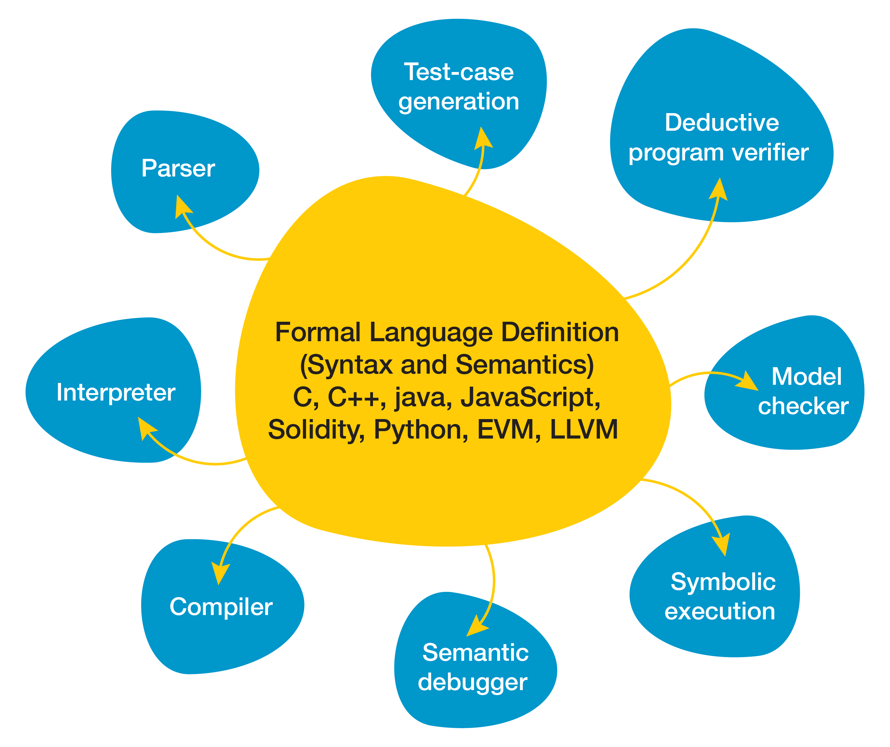

\newcommand {\K} {$\mathbb{K}$}

Abstract
--------

Test case generation tools need to be aware of the semantics of the tools they
are targeting in order to generate programs the exercise "deep" paths. However,
their development is expensive and are only available for a few languages in
widespread usage. Language agnostic fuzzers alllowing testing many more
languages in the same tool reducing devlopment costs. Thus, most test case
generation tools are either language-agnostic or semantics-aware, but not both.

The semantics-first approach to language development gives us insight into how
this problem can be solved. As prescribed by this approach, we will build a test
case generator that is parametric over the formal semantics of the language. We
intend to use the \K{} Framework as the basis of our work. This
framework allows defining programming languages semantics and deriving various
language tools (e.g. parsers, interpreters, deductive verifiers, symbolic
execution engines...) from them. Currently, \K{} does not support test
case generation. Our work will focus on adding a test case generator to
\K{} and evaluating it with existing \K{} definitions of
languages like the EVM and JavaScript.

Motivation
----------

Test case generation tools we have seen so far, have either been: semantics-aware,
language specific, but can find "deep" bugs (e.g. jsfunfuzz, KLEE, Korat) or,
language agnostic, but semantics-unaware and only able to find "shallow" bugs
(e.g. AFL, LangFuzz).

This is because of the way programming languages are traditionally developed --
A rough natural language design or specification is written This is used to
guide the writing of a compiler or interpreter. When other language tools are
needed, the same process is repeated, treating the natural language document as
the source of truth. This kind of development goes against the traditionally
software engineering goals we strive for such as DRY (don't repeat yourself).

Fortunately, there is an alternative. The semantics-first school of thought
prescribes first writing a *formal specification* of the language's semantics,
and then using this specification as the source of truth. First, we define a
formal semantics for your language. Then, from that formal semantics, we derive
the various tool we need, such as parsers, compilers, interpreters, deduction
engines and test case generators.

{width="100%"}

The \K{} Framework is a language framework that takes such an approach. Several
large, real-world languages are already have semantics defined in \K{}, such as C,
Python, LLVM, Java, JavaScript, EVM and Solidity. The \K{} Framework is also
already able to derive a parser, interpreter, symbolic execution engine, model
checker and a deductive verifier from these semantics.

The \K{} Framework, however, does not yet derive a test case generator. This
project aims to remedy that situation by developing a test case generator parametric over the
input language that is both language-agnostic, and semantics-aware.

\pagebreak

Proposal & Milestones
---------------------

In this project, we aim to use the existing language semantics to generate test programs.
We divide this project into two parts. In the first, mostly an engineering effort, we
will bring to the level of current language-agnostic frameworks. In the second,
a higher-risk research effort, we will attempt to leverage the language semantics
to generate more semantically interesting tests.

  --- ------------- -------------------------------------------------------------------------------------
   1  Engineering   Grammar based generation
   2  Engineering   Use coverage information for feedback for mutation
   3  Research      Can we combine symbolic execution with instrumentation in interesting ways?
   4  Research      Can we use the typing semantics of the language to generate more interesting tests?
  --- ------------- -------------------------------------------------------------------------------------

1.  In our initial goal is to generate programs that are only syntactically
    correct using the program grammar that is part of a \K{} semantics. We will do
    this by extending \K{}'s haskell backend and using the Hedgehog haskell
    library.

2.  Our next goal is to leverage \K{}'s coverage information as a guide to which
    programs are most interesting to mutate.

From there, we move on to more research questions.

3.  Research Question: Can we combine symbolic execution with instrumentation in
    interesting ways?

    We hope that this will allow us to generate programs that exercise more of
    the programs semantics, e.g. by only using variables that have already been
    declared.

4.  The typing semantics for languages may also defined in \K{}. This may allow us
    to define a type-based generator as an improvement over grammar based ones.

Evaluation
----------

1.  Compare code coverage found using our tool with languages that already have
    test case generator
2.  Run the tests generated by our generator, and run them against other
    interpreters for the same language. This would be useful for e.g. finding
    bugs in other JavaScript interpreters.
3.  Try our generator on a variety of languages: imperative, stack-based,
    functional

