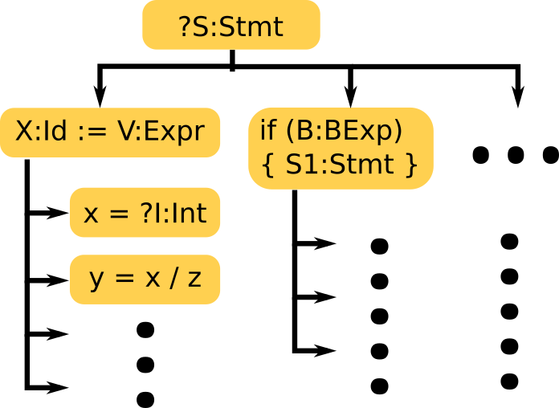

Motivation { #sec:motivation }
==========

Test case generation tools need to be aware of the semantics of the languages they
are targeting in order to generate programs the exercise "deep" paths. However,
their development is expensive and are only a few are in widespread use.
Language agnostic fuzzers on the other hand work for multiple languages, but
can only find "shallow" bugs. Thus, most test case
generation tools are either language-agnostic or semantics-aware, but not both.
For instance, jsfunfuzz for Javascript, KLEE for LLVM and Korat for Java can
exercise deep bugs, but are langauge specific. On the other hand AFL, and
LangFuzz are grammar based tools that work for multiple languages, but aren't as
effective at exposing deep bugs.

This is because of the way programming languages are traditionally developed.
A rough natural-language design or specification is written first.
This is used to guide the writing of a compiler or interpreter.
When other language tools are needed, the same process is repeated, treating the natural language document as the source of truth.
This kind of development goes against the traditionally software engineering principals such as DRY (don't repeat yourself).

The semantics-first approach to language development gives us insight into how this problem can be solved.
This approach dictates that the formal semantics of a language be defined first,
and tools such as interepreters, compilers and debuggers be derived from said
formal semantics. As prescribed by this approach, we will build a test
case generator that is parametric over the formal semantics of the language.

As the basis of our tool, we intend to use the \K{} Framework.
\K{} is a language framework that has already been used to define several
real-world languages such as C, Python, LLVM, Java, JavaScript, EVM and Solidity. The \K{} Framework is also
already able to derive a parser, interpreter, symbolic execution engine, model
checker and a deductive verifier from these semantics. However, \K{} currently
doesn't have a test case generator. Our work will focus on adding a test case generator to
\K{} and evaluating it with existing \K{} definitions of
languages like the EVM and JavaScript.

\begin{figure}[h]
\includegraphics[width=0.45\textwidth]{k.png}
\caption{The ideal language framework}
\label{fig:ideal}
\end{figure}

Background
==========

In this section, we briefly provide an overview of \K{}.
We do this using a simple imperative language, `IMP`, important in the pedagogy of programming language semantics and design.
This language has all the usual imperative language constructs such as variables, `while` loops and conditionals.
While a simple language, it is complex enough to represent most of the important features of imperative programming languages.

## What is a \K{} definition?

\K{} definitions are formal mathematical specifications of a language, and consists of three parts.
First, the grammar of the language is described using `syntax` statements:

```
syntax AExp
   ::= Int | Id
     | "-" Int
     | AExp "/" AExp  [strict]
     > AExp "+" AExp  [strict]
     | "(" AExp ")"   [bracket]
syntax BExp
   ::= Bool
     | AExp "<=" AExp [seqstrict]
     | "!" BExp       [strict]
     > BExp "&&" BExp [left, strict(1)]
     | "(" BExp ")"   [bracket]
syntax Block
   ::= "{" "}"
     | "{" Stmt "}"
syntax Stmt
   ::= Block
     | Id "=" AExp ";"
     | "if" "(" BExp ")"
       Block "else" Block
     | "while" "(" BExp ")" Block
     > Stmt Stmt

syntax Pgm ::= "int" Ids ";" Stmt
syntax Ids ::= List{Id,","}
```

Second, the "`configuration`", a nested record like structure, describes both the structure of the program state, and its initial values.

```
configuration
  <imp>
    <k> $PGM:Pgm </k>
    <state> .Map </state>
  </imp>
```

Here, the programs state is a record with two fields, the `<k>` cell, initially populated with the program to be executed;
and the `<state>` cell initialized to the empty map, `.Map`.

Finally, the semantics of the language is described using a set of `rules` as transitions from one state to the next:

```
syntax KResult ::= Int | Bool

// Blocks and Statements
// ---------------------

rule S1:Stmt S2:Stmt => S1 ~> S2
rule {} => .
rule {S} => S

// Control Structures
// ------------------

rule if (true)  S else _ => S
rule if (false) _ else S => S

rule while (B) S
  => if (B) {S while (B) S} else {}

// Arithmetic & Boolean operators
// ------------------------------

rule I1 / I2 => I1 /Int I2
  requires I2 =/=Int 0
rule I1 + I2 => I1 +Int I2
rule - I1 => 0 -Int I1

rule I1 <= I2 => I1 <=Int I2
rule ! T => notBool T
rule true && B => B
rule false && _ => false

// Variables: declaration, lookup and assignement
// ----------------------------------------------

rule <k> int (X,Xs => Xs);_ </k>
     <state> Rho:Map (.Map => X|->0) </state>
  requires notBool (X in keys(Rho))
rule int .Ids; S => S
// variable lookup
rule <k> X:Id => I ...</k>
     <state>... X |-> I ...</state>
// Assignment
rule <k> X = I:Int; => . ...</k>
     <state>... X |-> (_ => I) ...</state>
```

\K{}'s symbolic execution and narrowing
---------------------------------------

As mentioned in @sec:motivation,
\K{} derives a number of tools from this definition.
Of particular importance to our tool is \K{}'s haskell backend.
This backend allows symbolic execution of programs for languages defined in \K{}.
For example, we may pass the following program as input[^inputformat] to the symbolic backend:

[^inputformat]: Note that since the language syntax does not allow symbolic variables, there are some additional steps to pass this symbolic program to the backend.

```
int x, y;
x = ?I:Int;
if ( x <= 5 ) { y = 1; }
else          { y = 2; }
```

producing the following output:

```
    <imp>
      <k> . </k>
      <state> (x |-> ?I:Int) (y |-> 1) </state>
    </imp>
  #And { true #Equals ?I:Int <=Int 5 }
#Or
    <imp>
      <k> . </k>
      <state> (x |-> ?I:Int) (y |-> 2) </state>
    </imp>
  #And { false #Equals ?I:Int <=Int 5 }
```

Here, the input program assigns to `x` a symbolic integer, `?I` and then sets the value of `y` depending on whether `x` is greater than $5$ or not.
The output indicates that there are two possible final program states -- one where `y` is assigned to `1` and the other where it is assigned to `2`.
Each of these states is associated with a "path condition", a constraint over the symbolic variables required for the initial program to reach that state.

\K{}'s symbolic engine is much more general than traditional language-specific ones.
Most symbolic execution engines are restricted to executing programs where
program variables are assigned symbolic values.
\K{}, however, being a language framework, makes no distinctions between
programming language values (such as integers, strings, objects, etc)
and language constructs (such as statements, expressions and control structures).
This gives us a powerful tool: we may symbolically execute not just programs with symbolic inputs, but *symbolic programs*.
This advantage is in fact leveraged by our fuzzer.

{ #fig:ideal width=40% }

Another key feature of \K{}'s is symbolic execution engine is "narrowing".
Narrowing is rewriting over symbolic terms.
When executing a rule needs to additional substructure on a symbolic variable in order to continue,
\K{} will add this detail and continue executing on all possible branches, as shown in @fig:ideal.

Our Prototype
============

Overview
--------

In this project (<https://github.com/nishantjr/fuzzing-with-k/>), we leverage \K{} to perform semantics-based fuzzing.
Our method of fuzzing can be viewed as an extension of both grammar-based fuzzing and of skeleton-based fuzzing.
Our tool takes advantage of \K{}'s symbolic execution engine to execute a **symbolic program skeleton**,
i.e. one where parts of the program themselves are symbolic.

We feed as input to our tool, a program skeleton with certain positions in the Abstract Syntax Tree (AST) holding symbolic variables.
These symbolic variables may be instantiated not just by values, but also by statements, class and function declarations
etc. For example, when prototyping our technique against the IMP programming language above, we used the following symbolic program
as input:

```
  int x, y;
  ?V:Id = ?I:Int;
  ?T1:Stmt
  ?T2:Stmt
```

In this skeleton, we have a program with two variables `x` and `y`, an
assignment statement, followed by two arbitrary statements.

The \K{} symbolic engine first adds the `x` and `y` variables to the environment.
It then encounters a symbolic statement. \K{} *narrows* (rewrites over symbolic terms) on that statement,
choosing each possible case instantiation of the symbolic variable. For example, \K{} a symbolic statement
may narrow into each of an assignment, an if statement, a while loop and so on.
Each of the parameters that these constructs take may then be further narrowed on.
For example, the left hand side of an assignment may narrow into various identifiers,
and the right hand side into various expressions.
Importantly, since the narrowing is driven by the semantic rules for the language,
only semantically interesting programs are generated.
For example, only declared variables are chosen for both the right and the left hand side of the
assignment statement. Magic numbers used in the semantics (e.g. if division by zero is a special case in the semantics)
are also found and exploited.

Rule Limiting {#sec:rule-limiting}
-------------

Simply enumerating as many programs as possible with this method is not viable however, since the search space
is unbounded. Further, we may spend a lot of time repeatedly exercising the same areas
of the semantics, for example, by generating deeply nested but uninteresting expressions on the right hand side
of the assignment in the first statement, without proceeding to the next one (for example, `2 + 2 + 2 + 2 + 2`).
It is also easy to generate programs that loop forever.

To avoid these issues, we must therefore guide the search. We do so by recording
the coverage for some rules and stopping symbolic execution once a program has
executed any of these rules a certain number of times. Besides guiding the
semantics, this also deals with non-terminating programs by disallowing the
rule for while loops executing too many times.

Black listing internal constructs
---------------------------------

While implementing the semantics, we often augment the language syntax with various constructs
to aid in its implementation.
For example, the Michelson language allows three types of basic containers. Its `ITER`
instruction allows looping over

Concretization
--------------

At this point, we are left with a program that, while more fleshed out than the original skeleton, still has some symbolic "holes" in it.
For example, since only branches that were executed are narrowed, there are still remaining symbolic variables.

```k
  int x, y;
  x = 2;
  if ( false ) { ?S:Stmt }
  ...
```

```k
  int x, y;
  x = 2;
  if ( false ) { { } }
  ...
```

resulting in a concrete program that may be executed by any interpreter for that language.

Evaluation
==========

We evaluate our prototype with two cases:
first, for generating programs for the pedagogical imperative language called IMP;
second, for generating programs for the Michelson, the language of the Tezos block chain.

The IMP language
----------------

As a proof of concept, We evaluated our prototype by generating programs for the IMP programing language.
Here, we used the following symbolic skeleton:

``` { mathescape=true }
int x, y;
$\square$ = $\square$:Exp;
$\square$:Stmt
$\square$:Stmt
```

This skeleton generates programs with two variables, one assignement and atleast
two statements. There may be addition statements. Using this skeleton, we
generated 1988 programs in under 10 minutes. These programs have 100% coverage:
they execute every semantic rule in the definition.

Below, we list some programs generated by our prototype.

``` { #fig:imp-programs mathescape=true caption="Example program generated for IMP" }
TODO
```

Michelson
---------

To evalaute our prototype against a real world language,
we instantiate it with Michelson, the language of the Tezos blockchain.
We use the following skeleton:

``` { #fig:michelson-skeleton mathescape=true caption="Skeleton used for Michelson" }
input   { Stack_elt int .AnnotationList -5 ; } ;
code    { ?V:Instruction } ;
output  { Stack_elt nat .AnnotationList 5 ; }
```

This skeleton sets the input stack to one containing a single integer,
and the contract code to a single instruction.
Since Michelson's `{ _ }` construct allows nesting instructions,
this actually allows programs with arbitrary number of instructions.
We, however, use the rule limits to allow programs with only 5 instructions.

`\framebox{\parbox[t][7em]{0.48\textwidth}{`{=tex}
We also specify and expected output stack, because we are using the Michelson test format `.tzt`.
However, this instantiation of our prototype is intented to be the basis for differential testing against the
referenect Michelson implementation. We plan of developing scripting to cross-check the \K{} michelson output against the reference implementation.
`}}`{=tex}

Below, we list some programs generated by our prototype.

``` { #fig:michelson-programs mathescape=true caption="Example program generated for Michelson" }
TODO
```


Future Work
===========

Turing our current prototype into a full fledged tool requires additional work, enumerated in this section.

### Efficiency

This prototype was developed to provide a demonstration of semantics based fuzzing.
However, for fuzzing the effectiveness of a tool directly relates to is efficiency
-- the more quickly one can generate programs, the more quickly one may find bugs.
We currently call into \K{}'s symbolic backend each time it needs to take a single execution step using the backend.
This means that each time we take a step, the backend needs to parse and load the semantics, take a step and unparse the configuration
and the fuzzer needs to parse the output produced.
This is very inefficient.
In the future, we may implement the fuzzer as an "execution strategy" within the symbolic backend, to save on these round trip costs.

Another option is to avoid \K{}'s symbolic backend as much as possible.
\K{}'s symbolic backend is intended for formal reasoning about programs.
In particular, it is intended to eventually produce formal proofs about a programs possible executions.
This is quite an overkill for fuzzing.
Fortunately, \K{} provides a second backend -- one aimed a fast execution of concrete programs (i.e. programs without symbolic variables).
This backend translates \K{} definitions into native code using the LLVM compiler infrastructure.
However, our tool depends on symbolic variables to represent parts of the program state that may to be fuzzed.
This may be worked around by "skolemizing" them -- we may generate new language syntax that allows symbolic variables to be treated as "uninterpreted" language constructs.
By "uninterpreted" we mean that there are no semantic rules defined over them,
and when program execution needs to "inspect" their values to continue execution, it gets stuck.
We may then convert these constants back into symbolic variables, execute the rule that needs to inspect the symbolic variable, and then pass the output
configuration back to the concrete backend.

### User interface & tooling

For this fuzzer to be useful, it must be convenient to use.
There are a number of improvements that need to be made for this.

Currently, the initial program state must be written in "Kore" -- an internal language used by various \K{} tools to communicate.
Ideally, we would be able to write this intial state directly using the
programming language's syntax, or \K{}'s syntax for writing semantic rules.

In its current incarnation, the prototype also requires manaul changes to the language semantics to provide instrumentation.
This step can be automated, so that we can use any existing language definition unchanged.

While conceptually simple, these are important changes that need to be made to the tooling for this fuzzer to be useful to a general audience.

### Improve concretization procedure

Currently, during the concretization process, we simple chose a value hard coded value for each sort.
For example, we always chose "2" for any symbolic integer remaining in the program.
We completely ignore the constraints that \K{} has generated.
We should instead use an SMT solver to generate a number of values that satisfy the path condition for that state.

### Improve coverage metric

Our current coverage guidance is quite simple -- we stop executing on branches where a rule has been executed a certain number of times.
This may suffice in a simple language like K, however, this may still be a massive search space for more complex langauges.
A more interesting heuristic may prefer programs that exercise rules that haven't been seen before, or even orderings of rules that haven't been seen.

### Automatic Instrumentation

As mentioned in section [@sec:rule-limiting], our tool needs to record
coverage metrics for rules to guide search and program enumeration.
To achieve this, the original language configuration is modified to
hold an extra cell for rule coverage information. Every rule in the
definition must also be modified to update the aforementioned cell on each application.
Note that these modifications simply store metrics about rules used during
execution, and do not affect the execution semantics of the language in any way.
For our prototype, we manually modified the definitions to track rule coverage
information. However, we intend to add capabilities to \K{} to automatically
modify the definition to generate coverage metrics, improving the usability
of our tool.

Next Steps
----------

More concretely, our next steps are as follows:

1. Build a tool, `kore-concretize` that takes as input a symbolic program state and produces a concretized version of this by replacing symbolic variables with concrete ones,
   by querying an SMT solver, or bo choosing concrete values from the language grammar.

2. Change \K{}'s compilation process to add the instrumentation needed for fuzzing, instead of manually adding these to the definitions.

3. Improve the user interface of the fuzzer so that users may write the skeleton using a mix of the concrete language syntax
   and \K{} syntax (for symbolic variables, etc.)

4. Re-implement the fuzzer as an execution strategy within \K{}'s symbolic backend.

Threats to validity
===================

Symbolic Execution is slow
--------------------------

Fuzzing using a symbolic execution engine is quite unusual, and so there are
risks associated with it.
The main risk is that, fundementally, symbolic execution is slow.
While fuzzing the number of programs generated is an extremely important factor
in the effectiveness of finding bugs.
This speed is not just something nice-to-have, but something directly affecting
the functionality of our tool.

There are, however, steps we may take to mitigate this.
Since \K{} provides another backend for fast, but concrete, execution, we may instead employ that backend.
Obviously, this cocrete backend is unable to handle symbolic variables, essential to our fuzzing technique.
We may work around this, by extending the language with concrete constants representing those symbolic variables
(essentially "Skolemnizing" the symbolic program), and execute the program using the fast backend.
Then, when execution depends on the symbolic variable, the fast backend will get stuck (since this constants have no language semantics defined).
We may pass this partially executed program to the symbolic backend until program execution no longer depends on the variable,
and then resume execution on the concrete backend.

Dependency on the language semantics
------------------------------------

Our fuzzer depends on a \K{} semantics for the language existing.
Since we belive that a semantics-first approach to language development is superiour to other approaches,
and there are several other advantages to having a formal semantics, with important practical applicability,
we do not consider this in itself a disadvantage.

However, since the fuzzer leans on the language semantics, it will generate
tests that focus on the behaviours defined in the formal semantics. For example,
it will not be able to detect bugs due to magic numbers used in other
implementations, but not in the formal semantics.

Conclusion
==========

In conclusion, we have demonstrated a prototype for a semantics-first approach to fuzzing that is both language-agnostic and semantics-aware.
This approach works both for fuzzing interpreters and for fuzzing inputs to programs.
